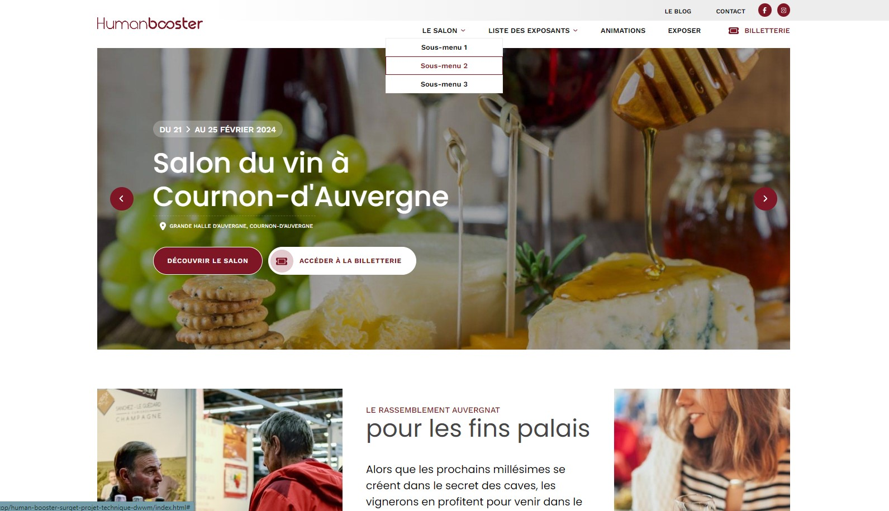
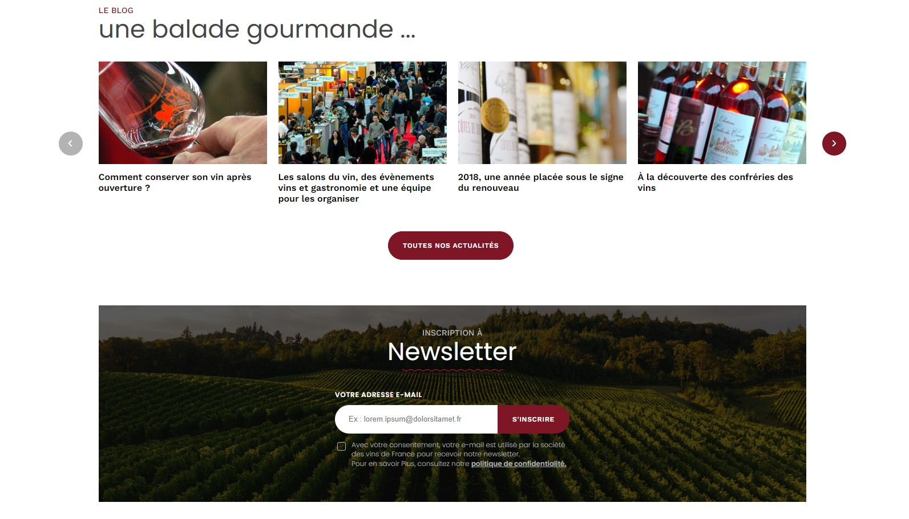
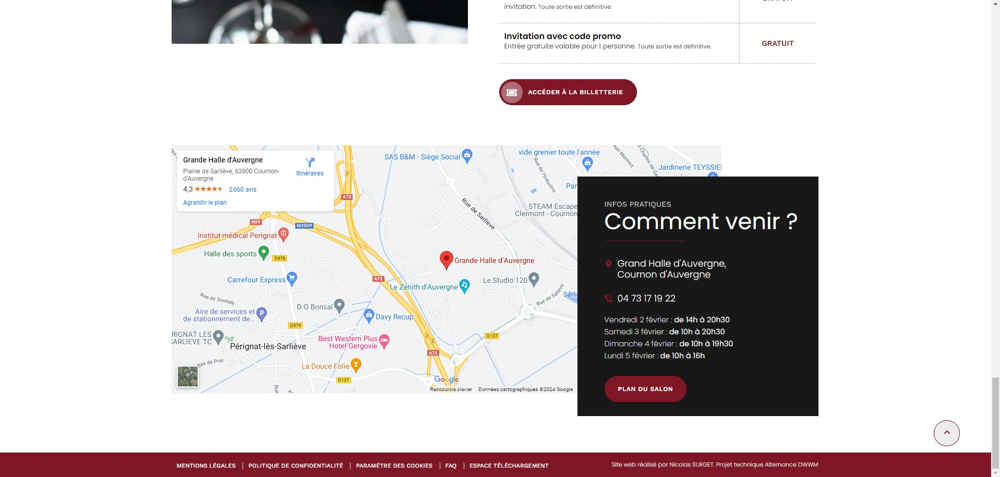

# Projet technique Dev Web et Web Mobile - Reproduction d'une maquette

Ce projet consiste à reproduire fidèlement une [maquette](https://www.figma.com/proto/VKZtad8vfHGDt12wO3vLmq/Human-Booster---Maquette-Salon-du-Vin?type=design&node-id=0-3&scaling=scale-down-width&page-id=0%3A1&hide-ui=1) fournie
 en utilisant HTML, CSS et JavaScript. L'objectif est de respecter la structure des différentes sections, le design et les couleurs autant que possible.

## Aperçu

## Téléchargement et Installation

Pour utiliser ce projet, suivez ces étapes simples :

1. Téléchargez le repository en cliquant sur le bouton `<> Code` et en sélectionnant "Download ZIP".
2. Décompressez le fichier téléchargé.
3. Ouvrez le fichier `index.html` dans votre navigateur.

## Contenu du Projet

- `index.html`: Fichier principal HTML.
- `/styles`: Fichiers styles CSS.
- `/js` (Bonus): Fichiers JavaScript pour le carrousel et le slider.
- `/images`: toutes les images utilisé sur la page.

## Commentaires dans le Code

Le code est commenté pour faciliter la compréhension et la maintenance. Chaque fichier HTML, CSS et JavaScript comprend des commentaires expliquant différentes parties du code.

## Auteur

Surget Nicolas 
 
